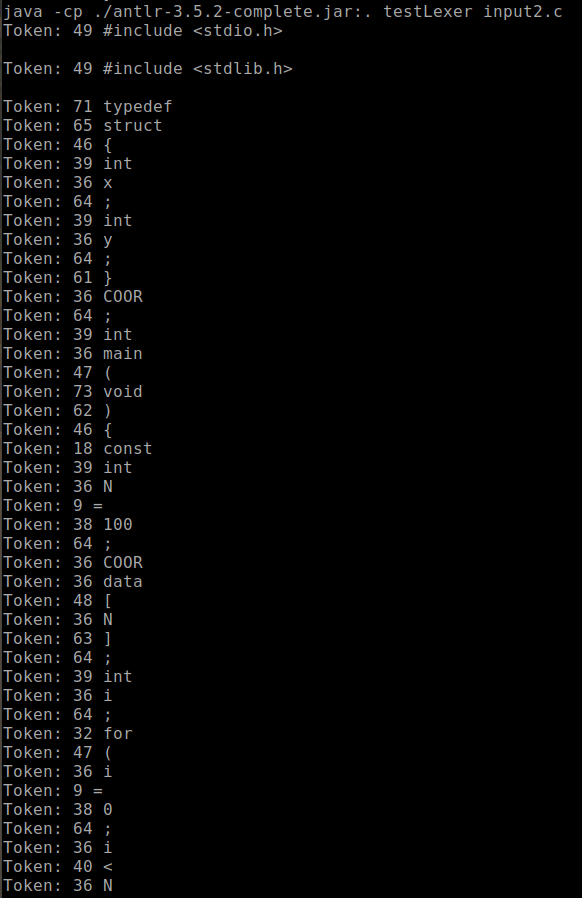

Lexical Analyzer
==

## Introduction

Lexical anlyzer to parse C program.

## Requirements

```
antlr-3.5.2-complete.jar
openjdk 11.0.6
```

## Setup

1. Locate the project folder
2. Check you have java jdk in your environment
3. Check in antlr-3.5.2-complete.jar is in the folder and its working by typing `java -jar antlr-3.5.2-complete.jar`
4. type `make`
5. `mylexer.java` and `mylexer.tokens` will be generated and the output lexer will be print on the screen

## Test C programs

1. input1.c: Test if all the basic calculatation using C is working
2. input2.c: Test if loop is working
3. input3.c: Test is structure, link list, and comments are working

## Results


