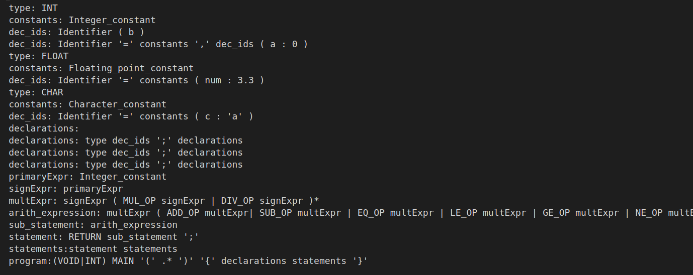

Parser
==

## Introduction

Decide the language the set of language features I want to support for the my compiler, and write the syntax analyzer (parser). Instead of generating the codes, I only output grammar rules in the code generator part to test whether the grammar is correctly passed.

## Requirements

```
antlr-3.5.2-complete.jar
openjdk 11.0.6
```

## Setup

 1. Locate the project folder 406410035_prj2_v1
 2. Check you have java jdk installed in your environment
 3. Check if antlr-3.5.2-complete.jar is working in your environmnet by typing `java -jar antlr-3.5.2-complete.jar`. If not working you must download it from ANTLR website and put it in the project folder
 4. type `make`
 5. The testing result will be shown on both the screen and the files in the project folder
    * test1.c -> test1_result.txt
    * test2.c -> test2_result.txt
    * test3.c -> test3_result.txt

## C Test Programs

1. test1.c: Test basic variable declaration
2. test2.c: Test nested if, else if, else and printf statements
3. test3.c: Test nested for, while, if statements

## Result


